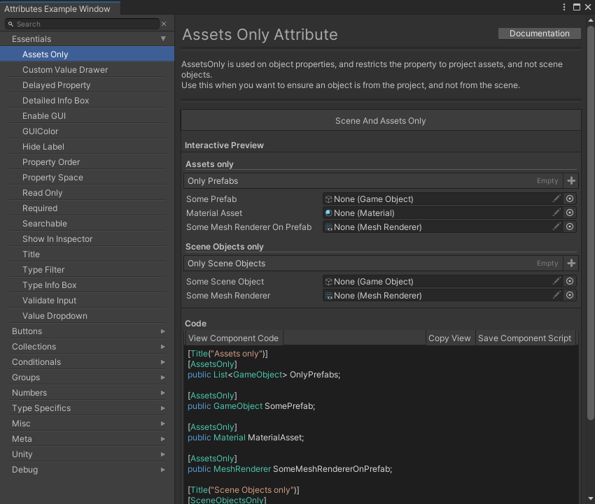
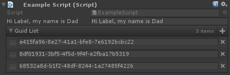
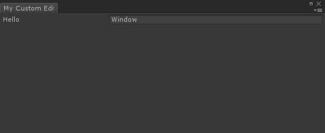

# Obdin基础介绍

Odin是一个Unity插件。根据官网介绍，器主要目的是使得用户可以享受强大，可自定义，用户友好的编辑器，而不写一行编辑器代码。即Odin实际是一个编辑器扩展插件，来方便做一些编辑器扩展。

当安装Odin插件后，会在菜单栏Tools中增加一个OdinInpsector选项。


通过GettingStarted可以入门编辑器内容。

可以看到基础有四部分

* OdinAttributesOverview
* OdinEditorWindows
* TheStaticInspector
* TheSerializationDebugger

但是者四部分在Unity中都是使用。文章主要记录基础入门介绍。对于每个部分细节，放在后面深入挖掘。

对于Odin教学，官网有指引：
https://odininspector.com/tutorials/using-attributes/simple-attribute-examples

## Attributes


通过Odin可以只通过Attributes来设计Unity中的Inspector界面。这里所说的Attributes实际是指C#语言中的Attributes概念，即注解功能。通过注解，而不用写一些注解解释代码，借助Odin我们可以高自由度自定义设计Inspector界面。实际上Unity自身也带有一些属性反射到Inspector界面上的功能，该功能相当于是威力增强版。

在Unity的OdinAttributesOverview中有所有Attributes的分类使用和说明。




在此只根据官方教程，介绍一些基础Attributes以及规则。经验性总结放在后面挖掘。

* 可以组合多条Attributes

例如预览界面


```Csharp
[PreviewField, Required, AssetsOnly]
public GameObject Prefab;

[HideLabel, Required, PropertyOrder(-5)]
public string Name { get; set; }

[Button(ButtonSizes.Medium), PropertyOrder(-3)]
public void RandomName()
{
    this.Name = Guid.NewGuid().ToString();
}

```


* 可以用Group来完全修改布局方式

```csharp
[HorizontalGroup("Split", Width = 50), HideLabel, PreviewField(50)]
public Texture2D Icon;

[VerticalGroup("Split/Properties")]
public string MinionName;

[VerticalGroup("Split/Properties")]
public float Health;

[VerticalGroup("Split/Properties")]
public float Damage;
```


* 有很多属性可以来引用其他属性内容，方法等来扩展编辑器行为。

```csharp
[LabelText("$IAmLabel")]
public string IAmLabel;

[ListDrawerSettings(
    CustomAddFunction = "CreateNewGUID",
    CustomRemoveIndexFunction = "RemoveGUID")]
public List<string> GuidList;

private string CreateNewGUID()
{
	return Guid.NewGuid().ToString();
}

private void RemoveGUID(int index)
{
    this.GuidList.RemoveAt(index);
}
```




剩下官方介绍了一些常用的属性方式

* GroupAttributes：布局用属性。
* MetaAttributes：被这些标记的属性，当属性变化的时候会调用一些指定方法。
* PropertyOrder：显示层级。
* AttributeExpressions：属性注释。

## EditorWindows

Odin插件也可以用来做一些编辑器窗口，用来简化一些工作流程。当然这也会在维护上面带来一些阵痛。

OdinEditorWindow功能基于Unity提供的EditorWindow功能。使用OdinEditorWindow继承该类型即可，继承之后就会获得渲染属性，方法的能力。

也可以继承OdinMenuEditorWindow来获取类似于MenuTree的编辑器界面。


```csharp
using Sirenix.OdinInspector.Editor;
using UnityEditor;

public class MyCustomEditorWindow : OdinEditorWindow
{
    [MenuItem("My Game/My Editor")]
    private static void OpenWindow()
    {
        GetWindow<MyCustomEditorWindow>().Show();
    }

    public string Hello;
}
```


对于面板的内容可以简单的通过Attributes来设计，配置。


也可以在EditorWindow中渲染任意一个Object。方法是通过重载GetTarget方法，并且传入任意类型的一个实例来实现渲染。该类型不需要可序列化(Serializable)或者必须是一个UnityObject。


## StaticInspector

一个静态的Inspector，主要用来监控一些数据。


## SerializationDebugger

序列化Debug工具。


# 经验补充

## Dictionary序列化问题

Odin的Dictionary再2018版本后因为prefab改动。导致prefab的序列化出现问题。

目前发现的是，对于场景中的物体，用Odin设置Dictionary中数值后，在运行游戏中并不会生效。不论该物体是否与Prefab相关联。


但是对于ScriptableObject对象Dictionary任然生效可以用来做数据设置