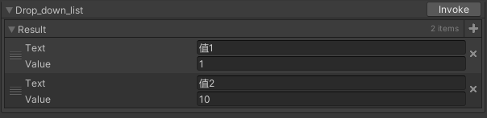

# Odin字段功能说明

本文章主要为功能记录文章，研究Odin每个字段的功能并且予以一定的记录。

Odin的OdinAttributeOverview中对字段已经进行了详细的说明。每个详细内容都可以通过文档查询得知。但是其中隐藏了很多功能的实现，本文主要以字段为索引，辅以功能实现介绍为主。


# 抽象类

因为抽象类结构无法被实例化，可以使得OdinInspector反射子类实现的数据结构到面板上。进而使得可编辑数据有着动态修改的能力。

# Label相关

# ValueDropDown

ValueDropDown字段属性给Inspector中的对应字段栏目提供了一个下拉菜单UI。通过下拉菜单中的选项可以给字段赋值。简单示例如下：


```CSharp
[ValueDropdown("drop_down_list")]
public int value_drop_down;

private IEnumerable drop_down_list = new ValueDropdownList<int>
{
    {"值1",1 },
    {"值2",10 },
    {"值3",100 },
};


```

ValueDropdown属性中的ValuesGetter字段指明了下拉列表中的项目内容。该字段输入为一个string，指明获取列表方式。只要返回值是一个ValueDropdownItem类型的可以迭代的对象即可。而获取该对象的方式可以是
* 直接使用ValueDropdownList类型的数据结构来提供。
* 直接使用可迭代的序列化数据结构来提供
* 静态函数或者实例函数，返回一个可迭代数据结构来提供。更重要的是该方式可以通过一些方式获取到当前Unity编辑器中的数据结构。

该类型第一个值为Editor中显示数值，第二个值为实际数值。

除了可以修饰普通的属性字段外，还可以修饰列表类型字段，此时添加操作中的数值会变成下拉列表形式。简单示例如下：


```CSharp
[ValueDropdown("drop_down_list")]
public List<int> value_drop_down;

private IEnumerable drop_down_list = new ValueDropdownList<int>
{
    {"值1",1 },
    {"值2",10 },
    {"值3",100 },
};
```

<font size = 4>**备注事项**</font>

* 使用ValueDropdown字段功能时。可直接用数据结构指定下拉列表。此时目标数据结构实际只会调用一次构造。虽然其列表显示是不同实例，且持久化后实际是不同对象。但是目标下拉列表中的数据实际只会构造一次，简单情况如下。


```CSharp
[LabelText("效果列表")]
[ValueDropdown("drop_down_list")]
[ListDrawerSettings(ListElementLabelName = "EFFECT_NAME")]
public List<IncidentEffectStruct> EFFECT_LIST;

private IEnumerable drop_down_list = new ValueDropdownList<IncidentEffectStruct>
{
    {"值1",new DoDamageEffect()},
    {"值2",new BlockMoveEffect() },
};
// BlockMoveEffect构造中输出 构造调用次数
// 多次添加仍会显示：构造调用次数 1
// 但是后面读取结构，或者显示都是如图多个数据结构
```
* 使用ValueDropdown字段功能时。如果使用函数类型列表，且修饰List容器类型，则获取目标函数会被调用多次。

<font size = 4>**字段属性功能描述**</font>

* DisableGUIInAppendedDrawer：
  当修饰List属性的时候会启用。如果为true表示每个子项目类型也

* DisableListAddButtonBehaviour：
  当修饰List属性的时候会启用。为true表示下拉列表不是作用在添加按钮上面，即添加按钮不会有下拉菜单，会自动添加一个属性的默认选项。

* DrawDropdownForListElementsL：
  当修饰List属性的时候会启用。为true表示每个子项也会添加下拉菜单。

* IsUniqueList：
  当修饰List属性的时候会启用。添加的每个子项为唯一的。

* NumberOfItemsBeforeEnablingSearch：
  开启搜索个数。当下拉列表中个数大于该值时会启动搜索栏。

# Button相关

Button字段属性主要给Inspector中的对应字段栏目提供了按钮UI，一般用来修饰一些函数，简单示例如下：

<font size = 4>**备注事项**</font>

* 除了文档中情况，实际上Button也可以修饰有返回值的函数，当修饰该类型函数时，实际会出现一个Invoke按钮，相当于调用该函数。并且点击调用后，返回值会以Result的形式，经过Odin序列化呈现在InspectorUI当中。简单如下：


```CSharp
[Button]
private IEnumerable drop_down_list()
{
  return new ValueDropdownList<int>(){
    { "值1",1},
    { "值2",10 },
    };
}
```


# List相关

Odin对于List容器类型主要提供了以下几个字段：
* AssetList
* TableList
* ListDrawerSetting

其中最常用的就是ListDrawerSetting字段。Odin默认对于数组类型，以及实现了IList的类型都会会使用ListDrawerSetting来进行序列化显示。

备注点：
* 如果泛型类型List<T>中T是一个可以实例化的类型，则Inspector以及持久化类型会以该类型为主。实际上此时添加按钮操作就是实例化一个T类型并添加进列表。
* 如果泛型类型List<T>中T是一个抽象类型(Abstract)，则Inspector会展现子类实现类的数据结构。并且添加按钮操作实际上会选择子类并实例化出来。持久化序列也会以子类的格式保存起来。

<font size = 4>**字段属性功能描述**</font>
* ListElementLabelName：
  列表元素中每个元素Label命名来源。该字段值为一个string，Odin会通过反射的方式，经有List<T>中的类型T来获取该字段的值。因为是经过类型T，所以会以该类型T来解读数据结构，如果是静态变量，那么只会获得该类型的静态变量。


# Dictionary相关


