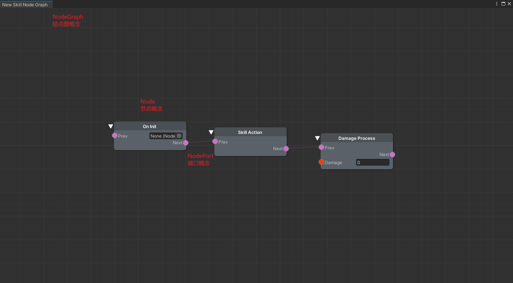
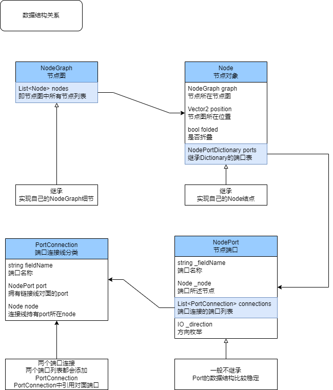
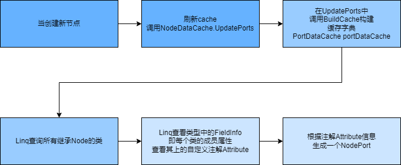
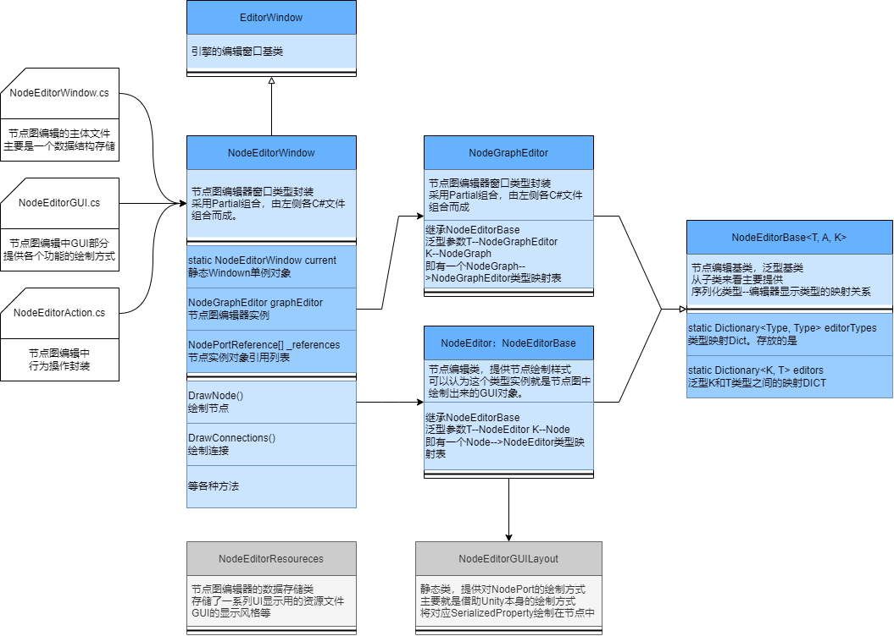
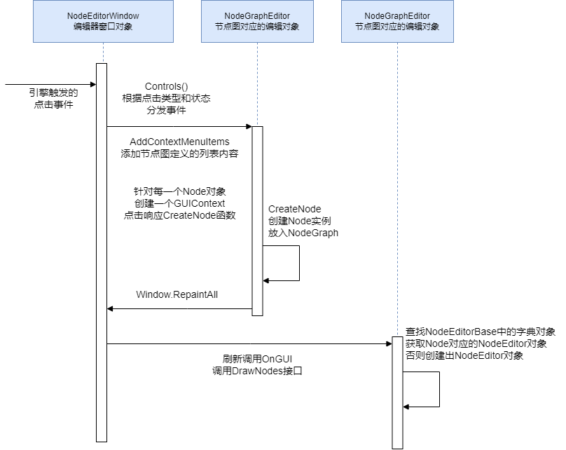
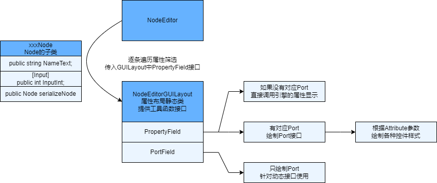
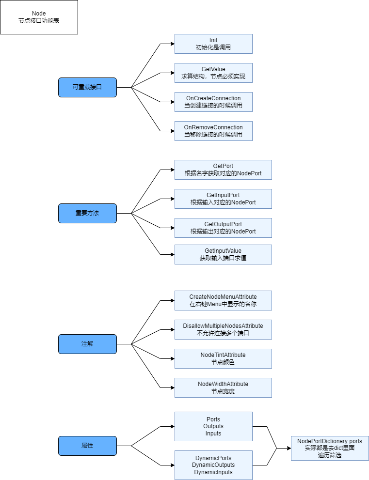
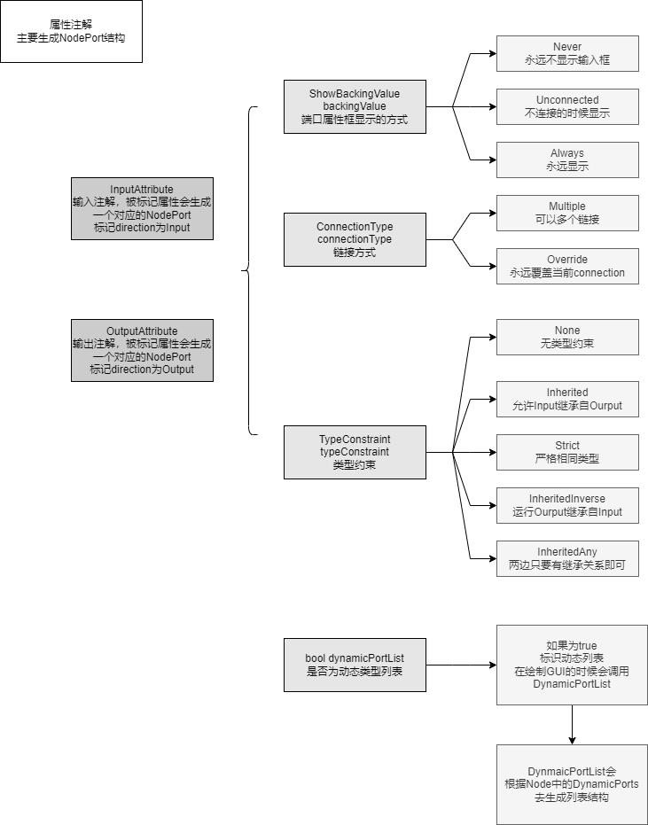

# XNode介绍

本文主要介绍我对XNode源码结构的刨析。查看一个其节点图的想法思路，方便我来进一步使用节点图，以及改造其结构。

网上也有一些视频讲解怎么使用如：
[xNode插件的简单使用][1]

本文也算是总结使用，顺便看一下其架构设计。


# XNode使用概述

从整个结构来看，XNode是简单而清晰的。其针对图，节点，端口三个概念进行了包装和处理，并没有给与这些概念过多的逻辑结构，这是很好的一点。而这些元素也精确的落实在了图表示上面，XNode的结点图可视化如下：

<center> </center>

先看一下其整个结构部分：

<center> </center>


从数据结构来看简单明了：

* NodeGraph：图对象数据结构，持有一个列表存着所有节点概念对象。
* Node：节点基类，相当于对节点概念的一个类型封装。子类型实现各个功能节点。其存在一个字典NodePortDictionary，存放了这个节点上的一个名字--端口的映射表。
* NodePort：端口概念的类型封装。有名字，方向（出或入）等概念。以及一个重要的链接表。存放着这个端口上所有链接的端口对象。


而对XNode结点图的使用也很简单：继承Node并且实现对应的功能即可向图中添加一个可以显示的节点如下：

```csharp
public class SkillActionNode : Node {
	[Input]
	public Node prev;

	[Output]
	public Node next;

	// Use this for initialization
	protected override void Init() {
		base.Init();
		
	}

	// Return the correct value of an output port when requested
	public override object GetValue(NodePort port) {
		return null; // Replace this
	}
}
```

其描述部分主要通过注解来建立属性字段与端口上的联系。

* 通过类Node，生成对应的节点对象。
* 通过注解，生成对应属性的端口NodePort对象。

而这个通过注解生成对应结构的部分则是结点图易用性，以及改造的重点。所以可以先看其注解生成整个GUI部分，再总结每个注解属性对应的功能，来详细了解整个结构。

# XNode整体结构

HighLevel思路很简单，我们定义的每一个类型都相当于一个节点类型概念，所以要建立一个类对象--到UI结构的描述映射。即创建每一个Node类($A$)，相当于一个节点原型($B$)。当创建节点的时候，实际创建($B$)描述的UI对象结构实例($B_1$)，以及一个对应的Node类的实例($A_1$)。其中($B$)就是这个节点的显示样式，($A_1$)就是落地的数据实例。

首先可以NodeDataCache文件，该文件包装了一个NodeDataCache的静态类里面有一个数据结构存放了每个Node类型，跟其关联的NodePort列表：


```csharp
// 节点的静态缓存结构
public static class NodeDataCache {
	// 节点缓存Dict 
	private static PortDataCache portDataCache;
	// PortDataCache 继承于 Dictionary结构 有Dictionary结构
	private class PortDataCache : Dictionary<System.Type, Dictionary<string, NodePort>> { }
}
```

然后当发生新的节点创建的时候，会触发重新构建cache的操作，简单流程如下：

<center> </center>

最后就是形成一个类型--节点端口的映射表。而这个映射表结构就是用来构建可视化Node节点UI结构的基础。

* 当编辑器运行的时候，通过这个类型--节点端口结构，生成UI上节点的**显示结构**。即这个节点编辑条，端口等。
* 根据节点图中实际存储的节点实例结构，结合UI显示结构，形成节点图显示。
* 当添加新节点的时候，生成实例，并在编辑器中显示节点UI。
* 最后编辑节点数据，编辑器落地数据到对应实例内。最后序列化成持久数据。
* 所以当游戏运行时，只有上面暴漏出来的Node，NodeGraph两个类型。而这也是开发者更关心的数据。

而这就涉及到整个编辑器侧的架构，编辑表现跟逻辑分离，之间只有编辑器数据部分是相互关联的。整个结构图如下：


<center> </center>


简单来说跟HighLevel想法对应。即NodeGraphEditor跟开发者关心的目标数据层NodeGraph结构关联。NodeEditor则跟数据层的Node关联。两个Editor类型提供编辑侧的绘制工作，以及借用Unity的属性反射结构，生成对应的属性Property的编辑窗口，进而可以编辑属性并且落地到数据层上去。

可以通过几个较为重要的运行时流程来看整个结构

**<font size = 4> 添加节点 </font>**

<center> </center>

添加节点一般通过在节点图中右键来打开一个菜单栏实现。
其调用过程就如上图：

* 点击触发后，从NodeGraphEditor中获取整个菜单来内容。
* 菜单栏中的一项，绑定响应时间CreateNode。点击后创建对应的Node。
* 对应Node创建后重新绘制Window。
* 重新绘制过程中，创建NodeEditor，构成编辑器中的GUI节点对象。


**<font size = 4> Node绘制细节 </font>**

绘制节点的方法基本都封装在NodeEditor中，这相当于NodeEditor即描述了一个Node如何绘制成GUI节点，同时又相当于GUI节点的实例对象。同时其基类，NodeEditorBase中还存有一个静态字典，形成了一个Node和NodeEditor实例的全局映射表。从这些结构来看，这里封装可能有点混乱，但也是OK的。

绘制GUI节点主要位两个方法

* OnHeaderGUI：绘制标签。
* OnBodyGUI：绘制节点内结构。

其中我们可能更为关心的是对于节点内结构的绘制。其结构即是，便利类对象的属性列表，如果其可见遍调用NodeEditorGUILayout将其绘制出来。

<center> </center>


# XNode功能说明

基于上面，可以对整体结构有一个大概的了解。然后就可以很方便的理解提供的注解用途了。并且可以去扩展一些自己想要的功能结构。

在上面的参考文章[xNode插件的简单使用][1]中也已经对大部分功能做了详细的说明。

这里只是总结一些细节使用。


Node 相关内容
<center> </center>

NodePort 相关内容

<center> </center>


# XNode运行时

在运行时则简单化了。关注主体只有NodeGraph，Node，NodePort这些相关部分。因为相关的绘制部分全部由NodeEditor侧承当。所以可以单纯从底层数据结构触发获取整个结构，即加载NodeGraph后就可以获得整个序列化后的对象结构。

而运行时的实际效果则由需求决定细化：

* 可以放在节点内，把节点也当做游戏实际运行时的一环。这样可以方便做一些可视化Debug。
* 也可以把节点当作一个操作，实际功能承载交付给游戏内承载对象。

[1]:https://www.bilibili.com/video/BV12P411F7Zu/?spm_id_from=333.337.search-card.all.click&vd_source=8d35ead0946519f56d2ab5f9c83045df