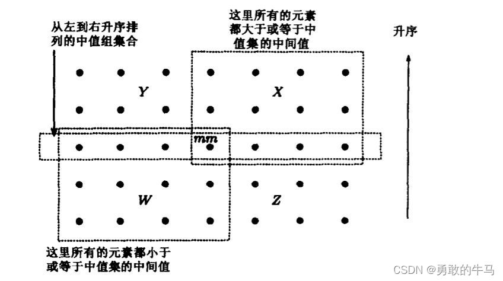

# 寻找前K个最大数

着是一个经典的面试问题，于是想在在这里记录一下相关的一些算法和思想。

问题描述：

* 给定一个包含n个数的乱序数组，寻找其中前K个最大数

网上也有很多相关文章的描述，例如这篇描述的也很详细，讲述了很多种算法特点。

https://blog.csdn.net/ywcpig/article/details/52476174

为了方便描述我们这里可以将其转换为等价的寻找前K个最小数，这样便于描述。

# 排序

其实最简单的方法就是--排序。排序花费$O(nlogn)$时间步骤后即可得到整个数组的线性序，通过线性序可以简单得到前K个最小数字。

但是这很值得思考，这是最快的方法么？这个方法利用了什么？这些方法是观察到了什么特点？

假设整个数组组成的集合为$S$，数组元素为$a_i\in{}S$，那么排序可以认为是为了获得如下的线性序：

$$a_1<a_2<\cdots<a_k<\cdots<a_n$$

通过该严格线性序结构，我们可以通过数组索引K快速获得前K个最小的数字。但是我们的目标实际上是求前K个最小的数字，这实际是一个划分问题，该个问题可以转换为求一个数$a_k$，满足如下条件：

$$a_1,\cdots,a_{k-1}<a_k<a_{k+1},\cdots,a_n$$

这个结构显然是比上面结构要弱很多的，这暗含，可能存在更快的算法，更好的结构来求算该结构。实际上存在$O(n)$算法求一个数组中第K小的数是什么。只要求出该数字，然后遍历一遍数组，取出所有比该数小的数即可满足结果。

# 随机算法思想

这个算法也来自于这本书

这个更快的随机算法来自于一个观察：

就是对于一个给定的元素$a\in{}S$，我们可以用$n-1$次比较回答以下问题。

* $a$是第K小元素么。
* 或者$a$大于第K小元素么。
* 或者$a$小于第K小元素么。

这个显然是可以的。所以思路就很简单了，随机选一个元素，然后求算哪些元素比其，哪些元素比其大，然后不断毕竟第K小元素。上面这个判定问题，使得其实际就跟2分查找的情况类似。

步骤如下：

* 使用任意元素$a$作为分界线，遍历数组，划分成如下两个集合
  * $S_>=\set{x\in{}S-a|x>a}$
  * $S_<=\set{x\in{}S-a|x<a}$
* 随后递归查找
  * 如果$|S_<|<K$则在$|S_>|$中查找第$K-|S_<|$小元素。
  * 如果$|S_<|>K$则继续在$|S_<|$中查找第$K$小元素。

$$S_>=\set{x\in{}S-a|x>a}$$

思路很简单，不过复杂的是，算法复杂度分析。时间地推关系如下

$$T(n)\leq{}max\{T(|S_<|),T(|S_>|)\}+O(n)$$

即遍历一遍的耗时，加上子树中的耗时。直观来看这个耗时跟选取的划分元相关，如果其恰好为$a_k$，那么一次遍历$O(n)$即可。如果运气不好的情况，我们将一个个剔除元素，这种情况下将是$O(n^2)$。

这里我们就需要考虑随机元素的平均情况问题。实际上对于选取的划分轴$a$如果其实际在数组中位置为$i$。那么显然有

* $i<k$。算法将剔除$k-i$个元素，剩下$n-k+i$个元素。
* $i>k$。算法将提出$n-i+1$个元素，剩下$i-1$个元素。

所以对于一次随机选择的平均情况。

$$\overline{T}(n)=\frac{1}{n}\sum_{i=k}^{n-1}\overline{T}(i)+\frac{1}{n}\sum_{i=1}^{k-1}\overline{T}(n-k+i)+O(n)$$

可以说当$k=n/2$时，处于最坏情况。则原公式变为：

$$
\begin{aligned}
\overline{T}(n) &=\frac{1}{n}(\sum_{i=n/2}^{n-1}\overline{T}(i)+\sum_{i=1}^{n/2-1}\overline{T}(n/2+i))+O(n)\\
&=\frac{2}{n}\sum_{i=n/2}^{n-1}\overline{T}(i)+O(n) 
\end{aligned}
$$

容易验证$\overline{T}(n)=cn$是符合递推公式的解：

$$
\overline{T}(n)=\frac{2}{n}\sum_{i=n/2}^{n-1}ci+O(n) \leq{}c(\frac{3}{4}n-2)+O(n)=O(n)
$$

不得不说，有些时候很多问题，随机算法往往有不错的结果。实际上我觉得这是因为，对于输入组成的线性序，可以认为是一个均匀分布，但是其中某些极差的结构，放大了算法的使用消耗。而随机算法，相当于用一个均匀分布，抹平了这些极差的输入状况。

# 寻找第K小元素

这个算法也来自于这本书

在该书中明确介绍了一个算法可以在$O(n)$时间内找到第K大数。实际上我觉得，这个算法算是随机算法的去随机化。在本书中的随机算法章节，也讲述了该算法。其观察则来自于，对于数组中剔除元素个数的操作。

即如果每一步都可以稳定剔除一定比例错误元素，例如$1/3$。那么对剩余$2/3$比例的元素会使得其指数降低，当剔除所有错误元素之后，就是逼近正确的元素。而这个过程的开销如果每一步都是线性耗时，那么最终耗时如下：

$$cn+(2/3)cn+(2/3)^2cn+\cdots+(2/3)^icn+\cdots=3cn=\Theta(n)$$

这个算法是这样运行的，具体细节可以看书：

* 将n个元素划分成$q=\lfloor\frac{n}{5}\rfloor$组。每组5个元素，如果5不整除p，则排除剩余元素。
* 针对每一组单独排序，找出中项。所有中项的集合为$M$。
* 递归调用，去除中项集合的中项元素$mm$。
* 通过mm将元素分组成三组
  * $S_1=\set{a|a<mm}$
  * $S_2=\set{a|a=mm}$
  * $S_3=\set{a|a>mm}$
* 分情况递归计算
  * $|S_1|>k$：递归计算$S_1$集合
  * $|S_1|+|S_2|\geq{}k$：返回mm
  * $|S_1|+|S_2|<k$：递归计算$S_3$集合中第$k-(|S_1|+|S_2|)$小元素。

不难明白这个算法一定能计算出正确的第K小数值。但是同样的，算法的效率分析非常复杂。

其实这个算法的分析关键点就是中位数$mm$筛选出了多数严格大于，严格小于的数字。实际上这个过程可以认为是把数字排成一个$5\times{}q$的矩阵，其左下角部分数字是严格小于，则右上角部分数字为严格大于。进而保证了$S_1,S_3$两个集合的大小。这个值大概是$\frac{3}{2}\lfloor{}n/5\rfloor\leq{}S_1\leq0.7n+1.2$。也就是每次留下的集合大小会在$0.7n+1.2$左右。最后可以推出，时间复杂度是严格$\Theta{}(n)$。

# 其他方式

其余的方法就是一些经典方法，这里只做一定解释。

## 最大堆方式

使用$O(n)$时间的MakeHeap算法，在原地将数组构建一个最大堆数据结构。然后Pop出顶部的K个最大元素即可。算法时间复杂度$O(n+klogn)$

## 基数排序方式

可以首先筛选一个最大数出来，假设其有$m$位。然后按照基数排序的想法，但是这里不用从最小的开始，而是可以从最大的开始，然后hash进$0-9$的桶里面，然后计数，可以逐步确定我们要的第K小数是落在什么桶里面。例如这里可能落在$4$号桶里面，则针对该桶内的数，继续进行基数排序操作。

# 结尾

其实可以看到，不论什么方式。这个问题最后落在的关键点都是一个问题。如何逐步的剔除那些非正确的数字。越快剔除的方法，其效率就越高。相对应的，如果能按照某个比例去剔除，那么他就会是一个线性算法。

# 参考资料

随机算法与寻找第K小元素元素在下面的书籍中有详细的介绍。

《现代算法设计与分析》

[印] Sandeep Sen, Amit Kumar

《算法设计技巧与分析》

[沙特] M. H. Alsuwaiyel

 