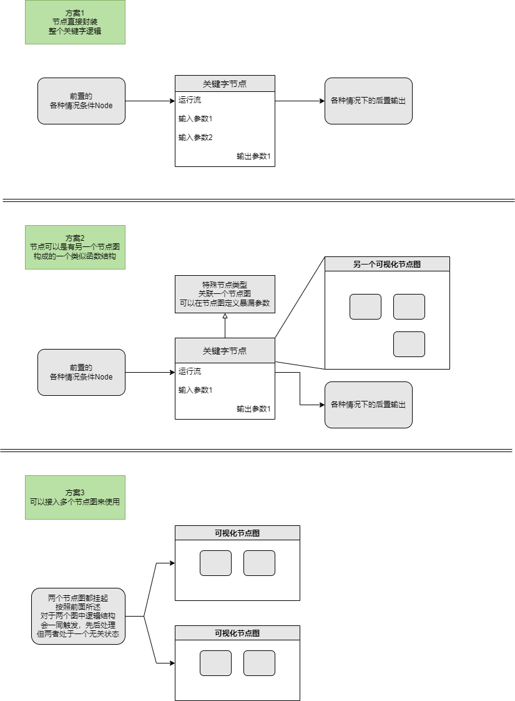

# 技能逻辑框架补充

本文主要记录一下技能框架文档中一些补充开发点与想法，绝大部分都是针对节点的颗粒度结构。相当于技能逻辑框架中节点结构的延展细化讨论，针对各种具体情况进行细化思考。

[技能逻辑框架](./技能逻辑框架.md)

# 使用条件

有些技能有一定的使用条件结构。例如卡牌游戏，当满足某些条件的时候，卡牌才可以使用。

* 满足某些要求才可以使用。
* 满足某些要求表现上会有变化。

# 关键字结构

【关键字】结构，即某一个【关键字】其实代表一个逻辑处理结构。简单例如《杀戮尖塔》中的【消耗】这种关键字，复杂如《万智牌》中的【议定】【循环】等关键字。
有些处理起来可能很简单，例如【消耗】可以简单处理成一个tag，而在某些时刻根据tag进入不同处理分支。而有些则可能是一串复杂的逻辑，例如【循环：花费X后，丢弃该牌，抽一张牌】。

但这种结构，不论通过一个tag数据字段，还是一段复杂的逻辑代码。我觉得其实本质意味着逻辑模板复用。即这个关键字对应的逻辑结构可以复用化。我想到有几种处理方法来做：

* 建立【关键字】对应的节点结构。使用该节点，即认为拥有该关键字结构属性。把相关逻辑都封装在节点内。
* 建立节点图上的节点复用结构。即，提供一个特殊节点，可以把另一个节点图的结构，在该节点图中复用。这相当于UE中的蓝图的Function功能，有一个特殊的节点图，有定义
* 建立节点图复用结构。即，一个技能结构可以使用多个节点图逻辑。相当于拥有多个节点图完整逻辑。

方案大致感觉如下：

方案3：
不一定能有效的处理很多情况。因为其没有前后输出，以至于不能抽象出一个流程模板结构，对于不同情况下的模板逻辑流程无法实现。例如上面的循环，核心部分是丢弃该牌，抽一张牌，但是其花费是不确定的，可以是消耗血量，也可以是费用，也可以是别的什么。另一方面这样一个节点图只能是一个自完备的逻辑功能，不能跟其他节点图产生化学反应。对于可以复用的整体逻辑该结构也是可以胜任的。

方案2：
是最完全的功能，其本质相当于UE中蓝图的Function，或者ASE中的材质函数。包装一个特殊节点，节点内部逻辑来源于另一个可视化函数节点流程，该节点图必须显示定义一个输入，一个输出。暴漏出外面调用时需要传递的参数结构，使得外面可以传递参数等。

方案1：
则相对朴素简单，即相当于把方案2中的函数节点图内的复杂逻辑直接程序写在代码里。要修改内部的结构逻辑只能修改节点内代码实现。其支持跟方案2中一样的外部可变结构，只是没办法快捷修改关键字逻辑。

其实针对大部分情况，第一种方式已经足够了。即将关键字所有相关逻辑概念放在一个节点内，拥有该节点即拥有该关键字逻辑。该关键字可以带有后续的处理效果，相关的参数，以及先置输入。

这主要是建立在以下对于【关键字】的特性上：

* 之所以提取出关键字，是因为其有通用逻辑。通用逻辑就说明其结构统一，定义好后不会随便修改。玩家也才能感知到这个关键字对应的体验效果。
* 关键字个数增长不会非常迅速，因为创建关键字是为了复用某类逻辑结构，同时方便玩家快速get到。如果每个不同点都赋予一个【关键字】，那关键字将没有意义。所以关键字不会快速变化增长。

而这样建立的关键字由如下好处：

* 复用性保留，使用该节点就可以标记关键字。并且关键字自成一体。可以明确标识出该关键字相关内容。
* 可以嵌入到其他流程中去。在某些可变更点上跟外部节点图保持相融。

对于程序来说，方案1完全够用，因为不需要花费太多精力去修改节点图结构。同时修改关键字逻辑也很方便。
但是方案2则具有具有强大的通用性，但是这是一把双刃剑。其我把它放在下面来讨论。

# 节点图函数功能

