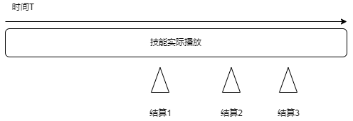
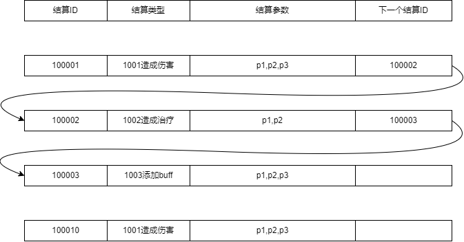
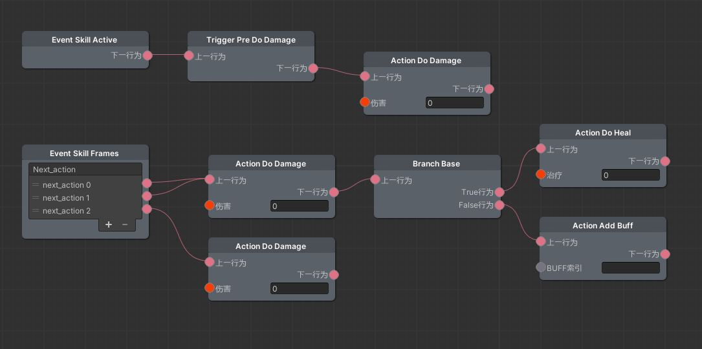
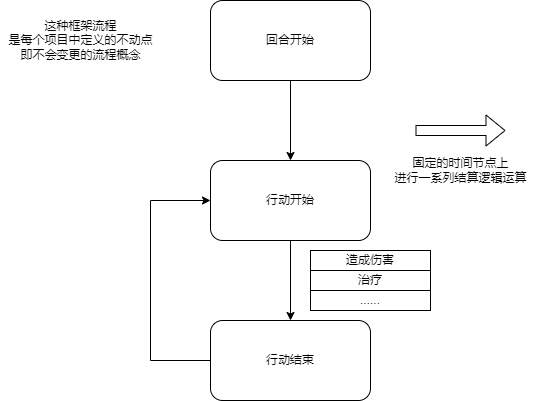
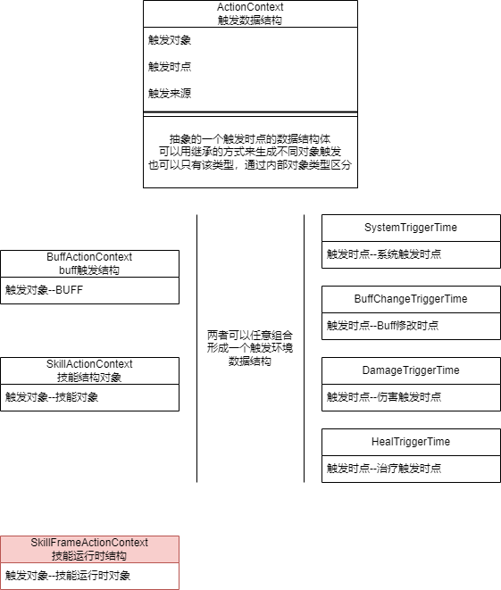
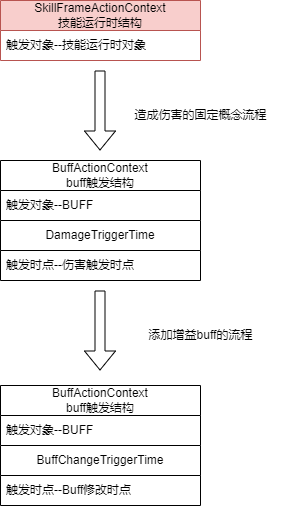
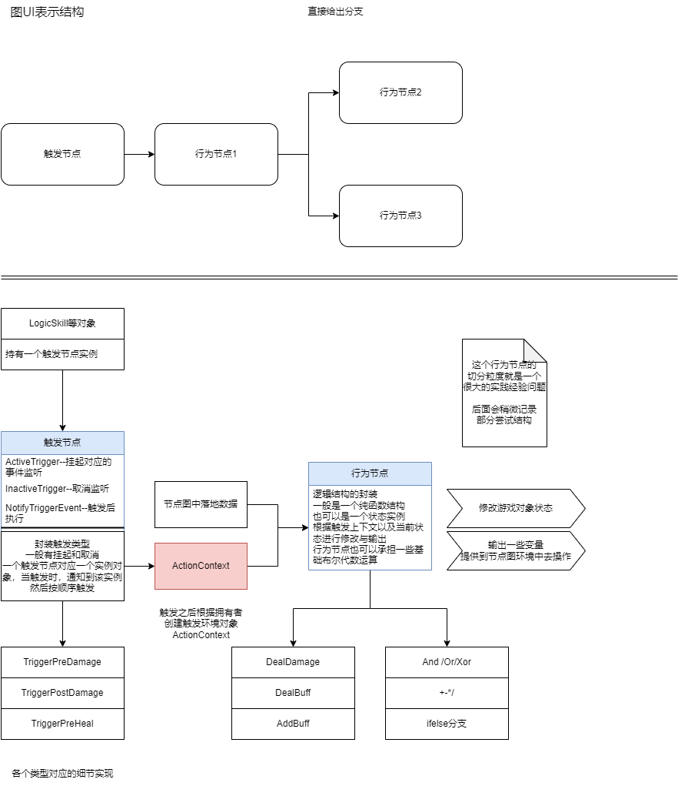

# 技能逻辑框架

本文主要记录在祖龙开发的战斗技能逻辑结构编辑器。本结构主要使用了节点图的概念来包装。实际上节点图本身就是一个执行顺序的图像化而已，其实可以从更底层的角度来看待一个节点图，即：

* 每个节点存在一个地址ID，同时存在一个逻辑操作，到该结点码执行该效果。
* 然后输出下一个节点的地址ID，确定接下来去什么节点运行。

本文讲述整个结构的架构思想，以及最后跟节点图结合的点。

往上也有很多类似的节点图编辑效果，只是涉及的方面有所差异，需要细化对待各个编辑器。

# 基本思想

游戏方式为一个播片动画回合制方式，即存在明确的角色释放一个技能的过程。播片部分的动画方式交由战斗编辑器来执行，具体可以见《战斗时间轴编辑器》文档。

所以将技能结算逻辑抽象化为，技能过程中，在某个时点执行的多个结算帧效果。如下图：

实际上这个结算触发可以通过物理碰撞来触发，相对于定时触发来说只是判定的方式不一样：

* 定时触发，相当于技能一定结算，只是结算内容有区别，例如阴阳师这种回合制就很合适。
* 物理触发，相当于技能通过在某个时间进行物理检车，通过物理判定才进行结算。物理空间纳入，一般为动作游戏考量。

因为游戏性质为回合制，所以可以采用定时触发，而且可以更好的配合技能表现效果运行。

所以游戏逻辑部分归结为每一帧结算逻辑的配置。在这里，我根据递归论，Lambda演算思想。认为可以将复杂的结算，归结到函数，或者说逻辑结算的递归调用。

根据计算理论，Lambda演算跟图灵即具有相同的计算能力，所以他是完备的。其次他形式很优美，本质就是递归调用的纯粹数学抽象封装。

所以我将每一个逻辑操作归结为一个操作类型，例如可以标记一个结算类型ID，造成伤害类型ID--1001。每一个结算操作会暴露一堆操作参数如p1--技能系数,p2--元素系数等。同时每个结算会给出下一个结算ID数值。注意结算类型ID和结算ID并不是统一个东西封装。

* 结算类型ID：是一个比较确定的逻辑操作流程。
* 结算ID：是一个结算流中引用的对象。

这个思路可以用如下的表结构来表示。

可以看到对于没有逻辑输出的操作类型来说，已经完全够用了。但是结算操作，难免会碰到一些添加判断，例如是否存在Debuff。这个时候就需要进行一个判断输出，True or False。这时可以简单想到扩展后面的跳转表头，增加新的几列，表示有不同输出的时候，跳转到对应表头结构。

这样一套结构，根据前面描述

* 可以实现所有技能所需逻辑效果。
* 同时扩展性强，重复工作可以大量减少。
* 表头结构固定，不用反复修改。

但是依然有不好的点

* 输出端口多的时候需要扩展列表表头。
* 输出指定参数的给另一个时需要嵌入输入端，输入端要建立一些方式获取结算输入，但是会导致表结构复杂。

这个时候我注意到项目组用的节点图编辑器，或者说UE自身带的节点图，跟递归调用，三地址码具有相同特点。而与此同时UE自身的节点也带有输出，输入，运行流的特征，可以包装整个结算效果。所以可以把结算流交给节点图来可视化编辑，同时提供基础逻辑节点来完成基础运算效果。

一个节点图的技能包装如下图

* 箭头方向就是触发时的结算方向
* 每一帧结算通过switch来分发出去，然后经过不同的节点来依次执行需要的效果。
* 对于参数则可以通过每个节点来包装输出，通过简单的减价乘除修改数值，ifelse来进行逻辑判断。

需要说明的是，节点图只是针对结算思想的UI包装化。是将上面结构的可视化。对于结构搭建本质还是思想指导落地代码。

节点图的视觉语言，实际可以等价为一个跳跃地址结构，其定义了如下数据结构

* 每个节点存在一个地址--NodeIndex
* 每个节点存在下一个地址--NextNodeIndex
* 地址内部逻辑--我们定义好的语义的运行逻辑，这个取决于我们的

每次经过内部语义计算后，给出下一个地址，并且到下一个地址来运行逻辑。可以把这个流程等效为一个树形图，每次逻辑会运行并且抉择给出向哪一个方向前进。但是图的跳跃更具有通用性。而这个方式跟图灵机的原理更有一定的相似性，即：

* 当前游戏运行状态，相当于纸带.
* 运行相应的节点逻辑相当于，规定的转移函数。转移函数修改纸带状态，同时给出下一个逻辑节点地址。
* 给出下一个逻辑节点地址，相当于图灵机状态寄存器的变化。
* 此外节点逻辑可以只进行修改，而不进行转移，将转移工作交由给一些通用结构来封装给出转移。

当然这并不是等价图灵机，实际上图灵机也没有给出下一个转移函数一说。只是可以看到，两者之间存在一定的相似性。这说明这样一个结构足以实现所有要求的逻辑，而不需要更改结构底层。

综上所述为什么采用这样一种封装结构，是因为考虑到有如下效果：

*  **结构强大，可以实现复杂的逻辑效果，而不更改结构核心。**
*  **在实现更复杂的效果时，节点可以平铺化。即不停扩展新的节点即可，剩下拼装操作交由给策划自己拼装控制。**
*  **效果容易理解，对于每一个流程都可以从图上显示的得知处理逻辑**

其实同时也可以看到，这个过程实际上跟写代码差异并不大，只是将代码中关键的一些ifelse结构暴漏在图中表示。

最后会发现，这些节点的组成，实际上会形成一系列胶水代码。而如何将策划的逻辑切分进入这些节点，则是另一个重要的组成部分。显然如果特别细致，那相当于将代码语言或者是程序语言用图重新表示了一番。变成策划用一堆底层工具搭建自己逻辑。如果特别粗糙那相当于，对应于每一个新想法都重新实现一个，而无法任何复用结合。

这一部分，我们放在文章最后去讨论。

# 抽象时点思想

在上面过程中，已经确定了技能在结算时的触发流程。将可复用的逻辑包装成了点，运行的流封装成了图表示。

但是上面结构只针对技能过程中某一次逻辑效果处理。对于buff等状态量，其存在各种触发时点与状况。例如如下的一些设计

* 每当受到伤害时，提升10%攻击力。持续一回合。
* 受到攻击后，获得等同于本次攻击内损失生命值百分比的护盾。

这里涉及到一个触发时点，与触发环境的问题。与技能不同的时，技能存在一个主动运行，然后触发的情况，而这些触发时点往往都是游戏概念结构中，带有的概念结构。结合上面技能结算的方式，实际上我们可以将这些概念统一起来。大致描述如下：

* 当技能运行时，通过时间或物理触发一次结算。这个触发就是一个触发时点。
* 当BUFF运行时，在定好的流程中。例如回合开始，回合结束，触发。这里也是一个触发时代你。

也就是说，这些都是游戏在运行过程中，**定义好的框架结构中的不变量，所带来的一些处理流程处理环节**。

所谓不变量，即游戏规则结构中，一般会通过游戏告知玩家确定的一个流程，并且往往是游戏中不变的概念。例如这里游戏中的回合，技能运行，例如对与MMO，移动，使用技能等这些情况。对应于不变量，在代码层级一定会有显示的状态封装代码，或者是流程封装代码。

所以这些流程时点的封装是跟游戏项目紧密相关的结构。可以描述为如下图

而技能运行流程也是定义好的一套不动点结构，在指定的时间发起对应的触发时点。

于是我们可以将结算结构，在技能和BUFF上进行统一。

整个结构抽象如下

每一次结算触发都包含一个触发对象，以及当此的触发时点环境。一般触发时点会通过事件的形式抛出，如果此时有对应的BUFF或者对象监听，就会将两者结合形成一个触发数据结构。所以左边跟战斗中创建的对象概念相关，右边则跟触发时点相关。两者可以结合形成复杂的概念。

需要注意的时，技能运行时是一个特殊的结构。实际上因为在运行时其上有攻击环境该概念，例如攻击者，防御者，所以有一个显然的技能运行时对象。同时有因为前文所述，有着固定的结算时点效果，所以其基本唯一对应结构。只是其也可以纳入一样的体系当中。实际上对于buff来说，其和法术场技能等本身都有对应差异。

每一个触发数据结构，都会索引上一级触发结构，这样就可以查找整个触发调用链路。并且知道所有触发时点以及情况。

这样可以让我们通过调用链知道复杂的触发情况而不混乱。例如：

* SKILL1：技能运行时造成伤害。
* BUFF1：当造成伤害时添加BUFF。
* BUFF2：当添加增益buff时候回复滋生血量。

最终会形成如下一个清晰的调用链

这样在这个结构中就可以清晰的寻找到调用环境。对于一些复杂的依赖关系也可以进行处理。例如BUFF效果，如果技能累积造成伤害大于10%血量，则添加一个等同于伤害的护盾也可以通过查找来实现。

但一般触发层次不会特别深，因为过于深很可能会出现触发环的情况，即语义层面的循环触发。另一方面是策划设计过深，技能效果强度策划自身也不好去把控。一般会将技能逻辑描述上去深挖。

# 代码框架

上面只是讲到整个框架提供的逻辑编辑结构以及实现的基本指导思想。但是没有讲到怎么建构代码，这里主要记录代码框架方面的搭建架构与细节。

综合上面所述可以看到几个指导思想

* 递归调用结构
* 节点图UI标识结构嵌入
* 触发时点结构

可以想到经典的ECA结构。即触发(E)--条件(C)--行为(A)结构。但根据上面的指导模型结构，实际上在这套结构里只有触发和行为部分。因为对于条件(C)和行为(A)都可以认为是一种带有输入输出的纯函数操作。但是对于触发(E)来说，因为其设计到流程监听挂接，不同的技能或BUFF监听的事件不一样，本质是要在一个公用Dispatcher中去加一个对象，详情可以见[架构理论](../../J架构理论/01容器化理论.md)，所以需要记录状态。而记录状态就导致了这两个操作完全不一样，非常本质的一点。所以两者可以大体划分为：

* 触发--对应着流程中固定的时点效果。要将启动触发时点挂接到对应流程中的监听列表中去。
* 行为--进行逻辑结算运算部分。这个状态可以有着M个输入同时有N个输出。

但两种对应到节点图中都是一个节点对象概念。只不过运行流不一样，导致节点理解层面有一定差异。

* 触发节点UI--触发后会挂起，然后当对应封装事件发生后会沿着该节点后的结算路径结算下去。
* 行为节点UI--触发后会结算，然后持续运行下去。

这导致了底层上也存在一定差异，例如

* 行为节点可以封装成无状态节点，即每个节点实际对应一个函数，都是函数操作。这样每个节点其实被没有状态记录结构。
* 但是有些时候，行动节点也可以封装一些有状态记录的节点。例如触发次数这种需要记录的逻辑结构。
* 而触发节点，因为要挂起后，触发对应事件就可以继续往下进行，这说明触发节点一定要记录状态。所以触发节点一定是一个实例对象。

进而每一个图中节点就具象化为两部分。

* UI编辑器显示部分，主要承担数据编辑器的责任。
* 对应的运行时逻辑，主要是节点封装的语义承载。

整个过程可以理解为：

* 节点图相当于UI显示与数据部分，解析该显示数据部分，生成游戏运行时部分。
  * 对于触发节点，一般生成对应的实例触发节点。
  * 对于行动节点，统一来讲可以生成行动实例触发节点。采用混入的方式，来单纯实现接口函数并注入。（所谓混入方式可以见[游戏架构理论-04类型系统](../../Y游戏架构理论/04类型系统.md)，对于面向对象而言可以认为是统一接口对象即可）

所以整体技能，BUFF等触发逻辑结构如下图：

这便是整个逻辑，包含BUFF，法术场，技能等逻辑结构的框架结构。

# 节点粒度结构

前面有提到过整体框架结构。可以总结有如下特点：

*  **结构强大，可以实现复杂的逻辑效果，而不更改结构核心。**
*  **在实现更复杂的效果时，节点可以平铺化。即不停扩展新的节点即可，剩下拼装操作交由给策划自己拼装控制。**
*  **效果容易理解，对于每一个流程都可以从图上显示的得知处理逻辑。**

但也说到，框架结构的完备性，即能通过节点实现多少东西，节点有多少复用程度，实际上取决与对节点的层次划分。

* 如果节点非常细致，例如只实现底层的布尔代数，与存储结构。其实就跟UE的蓝图一样了，变成策划用蓝图去拼接底层逻辑。节点图实际上变成了图形化的程序语言，我们相当于设计了一套程序化语言让策划去用。（这套图形语言的计算能力应该是跟图灵机等价的，我大致有个想法来证明这件事情）。那么根据编译原理与程序语言设计的一些哲学思想——程序开发本质都可以理解为是开发一套面向客户的特定语言——我们相当于把程序设计语言直接交给策划去使用，这与直接推一套程序语言，例如让策划直接学Lua，感觉没有太大差别。

* 另一方面是，对于游戏开发过程，从领域驱动角度开发来讲，很难完全只实现底层的抽象概念来满足策划所有情况。游戏领域之中，必不可少的会出现这个领域内的专业名词，例如文章的开头——技能——就是一个领域中的专业名词，再例如伤害，治疗这些概念，这些概念由策划设计建立，也必须由程序来建立对象。而策划的设计之中，必然有着对这些抽象概念的操作。而对应的节点中必然有对这些对象的操作节点。这些操作节点一定是要提供节点接口的，不可能让策划去通过节点拼装这么一个对象。

* 再从反方面来讲，如果每一个节点实际都对应一个领域中技能实现的对象。那么每个节点上实际上就是填写该技能数据参数，粒度就非常粗。搭建的这些可视化的结构，就没有意义了。

**所以对于节点流程的划分对整个体系的易用性，复用性很重要**。
不过好在，这是一个实践性问题。结构对颗粒度的支持非常大，跟上面讲述的特点一样，可以实现很粗的粒度使用，也可以实现很细的粒度。这也是我们想要的特点。一般而言可以先从大的方向去实现一个节点，然后随着概念逐渐明确，会拆分成一些常用的细小的节点，方便进行组装。但这些也都是在框架内即可进行的操作。

目前看来有一些简单的准则可以拆分出去一些结构：

* 前后节点线性无关，可以划分开。或者说，前后节点可以划分成两类，这两类节点之间可以任意组合。

例如对象筛选部分，对于回合制类型游戏，有很多目标选择相关逻辑，对于动作类，也有创建法术场等结构。这些部分跟后面进行结算的逻辑是无关的，其输出是一个对象列表，后面的逻辑都可以建立在该列表上操作即可。这说明这一部分，这一整块，可以跟后面逻辑拆分。

* 数值计算部分。

例如策划定义好计算公式之后，一般会形成一个占位节点树的结构（可以见[数值计算结构]()部分）。对于这个树一般会有一套默认的计算规则，但是每个节点存在多种替换计算规则。这些替换计算规则会涉及各种状态计算统计，最后替换公式中某一部分。这一部分结构一般通用泛化。

* 状态Check部分。或者说，把分支判定情况中细节节点包装化。

对于各种状态检查部分，都可以是一个简单节点，输出true或false。该部分可以非常细，然后通过包装的IfElse分支来组合复杂条件。其实对于输出true或false的节点，也可以省略真值输出，直接给出运行流向。但是对于很多依赖数值的判定，还是要建立获取数值——比较的判定方式。所以IfElse分支还是需要的，该部分相当于建立IfElse判定树。

# 结尾

整体来看这样一个结构，将一个结算的运行逻辑分解的非常细致，可以实现大部分复杂功能，并且简单易懂易于扩展。而且可以放到大多数游戏技能实现结构中，例如卡牌，回合制，甚至一些RPG游戏。

但不可否认的是，游戏结构，本身就很复杂，对于大部分3A类游戏来说，这些都还是不够用的，对于某些游戏来说，例如赛车足球，这些东西又毫无用途。

这里只是提出这么一套结构，可以去方便理清整个搭建思路。对于实际情况，可能还需要结合实际，不断优化完善，对于细节。

另一方面是，这个框架其实也很奇怪，感觉很多部分写了，但是又没写的感觉。抽象出了一个非常指导性的框架结构。